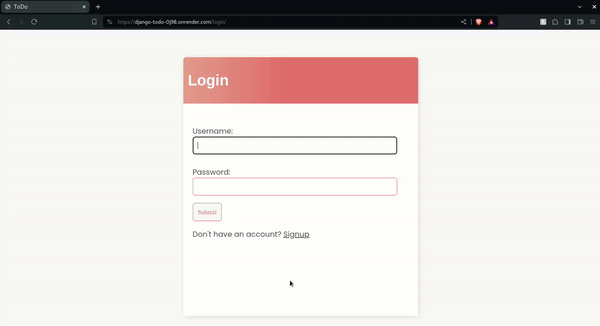

# Django based To DO Web App
A simple yet elegant To Do app for your daily needs. Comes with Llama 3 70B model integrated into it and gives real and specific 
suggestions and guidelines on completing your tasks efficiently. No matter if its something small like reminding yourself to eat a healthy breakfast or something important like that one assignment you have to turn in soon but cant figure out how to do, the
LLM will give you specific instructions if u need it. It could tell you what to cook for breakfast with step by step instructions or even how exactly to do that assignment you don't know much about.

## Live link
https://django-todo-0j98.onrender.com

## Recording

